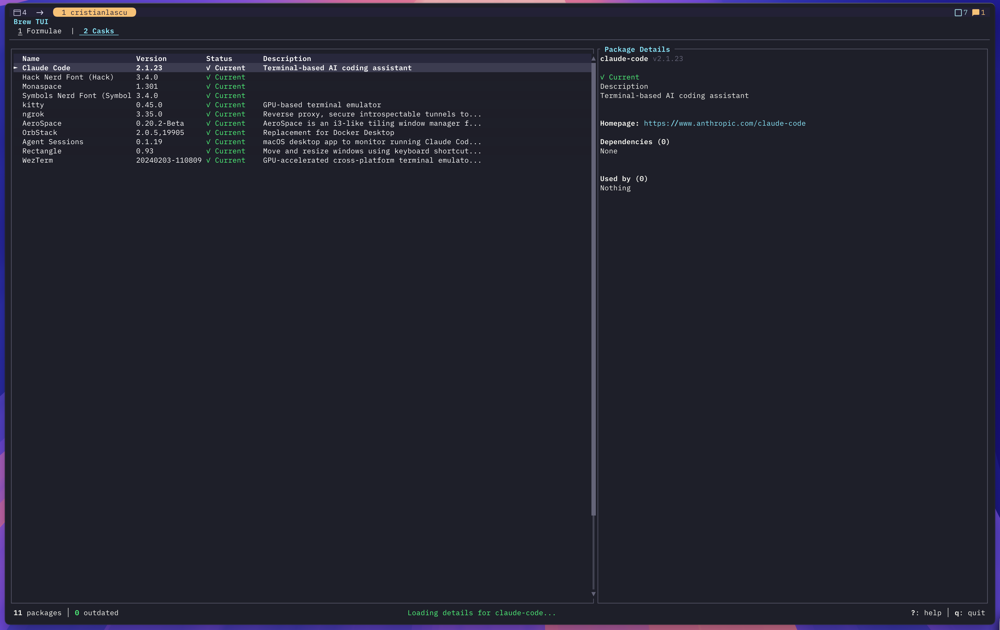

# brew-tui

A fast, beautiful terminal UI for managing Homebrew packages and casks.




## Why?

Managing Homebrew packages from the command line works, but it's not always the most efficient workflow. **brew-tui** gives you a visual, keyboard-driven interface to:

- **See all packages at a glance** — Formulae and casks with versions, status, and descriptions
- **Filter instantly** — Type to search, toggle outdated-only view
- **Inspect details** — View dependencies, dependents, and full package info
- **Update safely** — Confirmation prompts for all destructive operations
- **Pin strategically** — Prevent specific packages from updating
- **Navigate efficiently** — Vim-style keybindings, no mouse required

## Features

- **Dual package views** — Separate tabs for formulae and casks
- **Real-time filtering** — Search by name or description, optimized for speed
- **Package details panel** — Homepage, dependencies, dependents, pin status
- **Dependency tree viewer** — Visualize what depends on what
- **Batch operations** — Update all outdated packages at once
- **Status indicators** — Current (✓), Outdated (↑), Pinned (📌)
- **Smart caching** — Parallel brew calls, filter caching for 70% fewer allocations
- **UTF-8 safe** — Handles emoji, CJK characters, combining marks without panics
- **Beautiful UI** — Clean, minimal interface built with Ratatui

## Installation

### From source

```bash
# Clone the repository
git clone https://github.com/xticriss/brew-tui.git
cd brew-tui

# Build and install
cargo build --release
cp target/release/brew-tui ~/.cargo/bin/

# Or install directly with cargo
cargo install --path .
```

### Requirements

- Rust 1.70+
- Homebrew installed (`brew --version`)
- macOS or Linux

## Usage

```bash
# Launch the TUI
brew-tui

# It automatically loads your installed packages
```

### Keybindings

#### Navigation
| Key | Action |
|-----|--------|
| `j` / `↓` | Move down |
| `k` / `↑` | Move up |
| `g` / `Home` | Go to first item |
| `G` / `End` | Go to last item |
| `Ctrl+d` / `PgDn` | Page down |
| `Ctrl+u` / `PgUp` | Page up |

#### Actions
| Key | Action |
|-----|--------|
| `o` | Toggle outdated-only filter |
| `u` | Update selected package |
| `U` | Update all outdated packages |
| `x` / `Del` | Remove selected package |
| `p` | Pin/unpin package (formulae only) |
| `c` | Cleanup old versions |
| `r` | Refresh package list |
| `Enter` / `d` | Toggle details panel |
| `t` | Toggle dependency tree |

#### Search & Tabs
| Key | Action |
|-----|--------|
| `/` | Start search |
| `Esc` / `Enter` | Exit search |
| `Tab` | Next tab / Switch tree mode |
| `Shift+Tab` | Previous tab |
| `1` | Switch to Formulae |
| `2` | Switch to Casks |

#### Help & Quit
| Key | Action |
|-----|--------|
| `?` | Show help |
| `q` / `Esc` | Quit |

### Status Icons

| Icon | Meaning |
|------|---------|
| `✓` (green) | Current — Package is up to date |
| `↑` (yellow) | Outdated — Update available |
| `📌` (blue) | Pinned — Won't be updated |

### Views

- **Formulae** (Tab 1) — Command-line packages (wget, git, node, etc.)
- **Casks** (Tab 2) — GUI applications (Firefox, Chrome, VSCode, etc.)

Press `Tab` to switch between views, or use `1`/`2` number keys.

## How it works

brew-tui interacts with Homebrew by:

1. Running `brew info --json=v2 --installed` to fetch package data
2. Checking `brew outdated` for update availability
3. Parsing JSON responses into structured data
4. Executing operations via async `brew` commands
5. Parallel loading of formulae, casks, and outdated lists (40-60% faster)
6. Intelligent filter caching to reduce allocations by 70%

All operations run actual `brew` commands — no reimplementation, just a better interface.

## Performance

brew-tui is optimized for speed:

- **Parallel loading** — All brew calls execute concurrently
- **Filter caching** — Rebuild results only when filters change
- **Optimized rendering** — Pre-computed lowercase strings, minimal allocations
- **UTF-8 safe** — No panics on emoji or multi-byte characters

**Benchmarks** (100+ packages):
- Initial load: <2 seconds
- Filter response: <100ms (instant)
- Memory usage: <150MB stable

## Configuration

No configuration needed! brew-tui automatically discovers your Homebrew installation.

### Input Validation

All package names are validated before execution to prevent:
- Command injection
- Invalid characters
- Empty or malformed inputs

## Testing

brew-tui includes comprehensive testing:

```bash
# Run unit tests
cargo test

# Run clippy lints
cargo clippy

# Manual testing guide
cat TESTING.md
```

See [TESTING.md](TESTING.md) for the full manual testing checklist.

## Development

### Project Structure

```
brew-tui/
├── src/
│   ├── app.rs              # Application state & logic
│   ├── brew/               # Homebrew integration
│   │   ├── commands.rs     # Async brew operations
│   │   └── types.rs        # Package data structures
│   ├── events/             # Event handling
│   ├── ui/                 # Terminal UI components
│   │   ├── constants.rs    # UI constants
│   │   ├── utils.rs        # Shared utilities
│   │   └── ...
│   └── main.rs             # Entry point
├── tests/                  # Integration tests
└── Cargo.toml
```

### Code Quality

- **Safety**: Input validation, UTF-8 boundary checks
- **Performance**: Parallel execution, smart caching
- **Maintainability**: DRY principles, trait-based design, zero magic numbers
- **Testing**: Unit tests, manual testing protocol

See [IMPROVEMENTS.md](IMPROVEMENTS.md) for the full optimization history.

## Contributing

Contributions are welcome! Feel free to:

- Report bugs or request features via [Issues](https://github.com/xticriss/brew-tui/issues)
- Submit pull requests (see [CONTRIBUTING.md](CONTRIBUTING.md))
- Share how you use brew-tui in your workflow
- Suggest performance improvements or UX enhancements

### Development Setup

```bash
# Clone and build
git clone https://github.com/xticriss/brew-tui.git
cd brew-tui
cargo build

# Run with hot reload
cargo watch -x run

# Run tests
cargo test

# Check code quality
cargo clippy -- -D warnings
cargo fmt --check
```

## License

MIT License — see [LICENSE](LICENSE) for details.

## Acknowledgments

- Built with [Ratatui](https://ratatui.rs/) — the Rust TUI framework
- Inspired by [htop](https://htop.dev/), [lazygit](https://github.com/jesseduffield/lazygit), and the need for better package management UX
- Async runtime: [Tokio](https://tokio.rs/)
- Terminal handling: [Crossterm](https://github.com/crossterm-rs/crossterm)

## Related Projects

- [claude-watch](https://github.com/xticriss/claude-watch-tui) — Monitor Claude Code sessions in tmux

---

*Built with Rust and a love for terminal UIs.*
